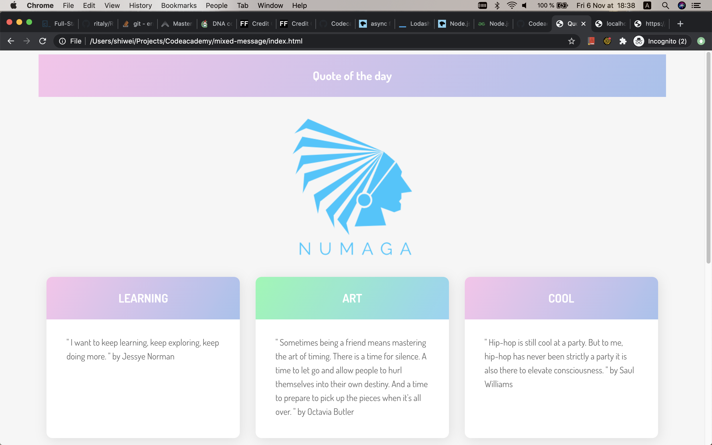

# **Mixed Messages**

In this project, you’ll build a message generator program that outputs a new, random message every time a user runs the program. Your program should
showcase basic JavaScript syntax and programming concepts.

## Table of contents

- [Overview](#overview)
- [Guide](#guide)
  - [Plan your project](#plan-your-project)
  - [Come Up with a Topic](#come-up-with-a-topic)
  - [Create script and run it locally](#create-script-and-run-it-locally)
  - [Set up version control](#set-up-version-control)
  - [Store message components](#store-message-components)
  - [Create the message](#create-the-message)
  - [Put the program together](#put-the-program-together)
  - [Resources](#resources)
    - [Debugging Tips](#debugging-tips)
    - [Example Code](#example-code)
  - [Next Steps](#next-steps)
- [Screenshots](#screenshots)
- [Prerequisites](#prerequisites)
- [Setup](#setup)
- [Features](#features)
- [Status](#status)
- [Inspiration](#inspiration)
- [Contact](#contact)

## Overview

For this project, you will build a message generator program. Every time a user runs a program, they should get a new, randomized output. You’re
welcome to take the project in a couple of different forms, like an astrology generator, inspirational message, or nonsensical jokes. To make your
program truly random, the message that it outputs should be made up of at least three different pieces of data. Take what you know of JavaScript
syntax so far to build the program and customize it to your liking.

**Project Objectives:**

- Build a message generator program using JavaScript
- Use Git version control
- Use command line
- Develop locally on your computer

## Guide

### Plan your project

Visualize your end result. What is it built with? What can it do? Make sure that it satisfies all of the project objectives.

Make a timeline for yourself and avoid the temptation to build things that aren’t required. Setting firm boundaries and deadlines will keep you on
track and prevent [scope creep](https://en.wikipedia.org/wiki/Scope_creep).

The following tasks will help you identify natural break points.

### Come Up with a Topic

Decide on what types of messages you want your program to output.

Think about what kinds of messages you’d like your program to output. Is it a horoscope generator? A fortune teller? An inspiring phrase? Knock-knock
jokes? Here’s an example of what the output of a horoscope generator could look like:

    Your sign is sun.

    You are having good luck.

    You should: "trust no one"

Remember, to make your program truly random the message should really be made up of multiple strings that are output together.

Think about what parts of the string could stay the same each time and what parts could change. In the output above, what do you think are the pieces
that change each time?

### Create script and run it locally

On your computer, create a JavaScript file to write your code in. Make sure you are able to run your script locally in Node.

Create a script.js file and try logging some text to the console.

In your terminal, navigate into your project directory and [run your script in Node](https://www.codecademy.com/articles/what-is-node). You should see
the text you wrote being printed to the terminal window. You can run your script at any point throughout this project to test it.

### Set up version control

Set up Git tracking in your directory and add and commit changes as you make them.

    git init my_message_generator

If you want a refresher on the syntax, you can review the
[Git lesson](https://www.codecademy.com/paths/full-stack-engineer-career-path/tracks/fscp-git-and-github-part-i/modules/fecp-introduction-to-git/lessons/git-workflow/exercises/git-generalizations)
or look at this [cheat sheet](https://education.github.com/git-cheat-sheet-education.pdf). It is good practice to do your work on a separate branch,
then merge to main in the end when you feel your code is ready.

### Store message components

Decide how to store all of the message components for your game.

Think about what kind of data structures would work best to store the information. An array would be a good choice here because you can randomly
access an array’s elements. Remember, there will be at least 3 sets of data that make up your final message so you might consider having multiple
arrays. You may want to nest these arrays inside of an object to keep them organized.

### Create the message

Add functionality to randomly select the different message components so they can create a cohesive message.

You can use a loop to iterate through the object, with a switch case that can select and format each of the different message components.

### Put the program together

Combine the different parts of your program so the random messages are selected, combined, and then displayed to the user each time they run the
program.

You can use a function to handle the overall formatting and display of the randomized message.

### Next Steps

You’re welcome to expand your program beyond these project tasks and get creative!

In addition to doing random messages, you could add random [ASCII art](https://en.wikipedia.org/wiki/ASCII_art).

### Resources

#### Debugging Tips

1. Feeling stuck? Try the following:

   - Google your question: oftentimes, someone has had the same question as you! Check out websites like StackOverflow and Dev.to to see how other
     folks have found solutions.
   - Read the documentation: make sure to carefully read through the documentation for any languages and libraries that you are using. Oftentimes
     they’ll have examples of what you’re looking for!
   - Rubber ducking: try to explain a problem to a friend or co-worker. Oftentimes you’ll figure out the solution as you’re trying to explain it. And
     if not, getting another pair of eyes on your code can be helpful.

2. Check out these helpful resources:

   - Thinking About Errors in Your Code Differently
   - Debugging JavaScript Code

#### Example Code

What to see an example of how someone else has completed this project?
[Click this link to download](https://static-assets.codecademy.com/Paths/full-stack-career-path/portfolio-projects/mixed-messages/script.js.zip) a zip
file containing one example solution to this project. Remember: your project doesn’t have to look anything like this! It should be unique to your
vision.

## Screenshots

### Prerequisites

- JavaScript
- CSS
- HTML
- Git and GitHub
- Command line

## Setup

Going off platform: You will be doing this project outside of the Codecademy platform, on your own computer.

For this particular project, you will be using your own text editor (we suggest VSCode) and
[Git version control](https://www.codecademy.com/content-items/74bb71f3f3d5998245e9bbef934502d9). If you need a refresher on how to work with Git for
version control,
[review the Git lesson](https://www.codecademy.com/paths/full-stack-engineer-career-path/tracks/fscp-git-and-github-part-i/modules/fecp-introduction-to-git/lessons/git-workflow/exercises/git-generalizations)
or look at this [cheat sheet](https://education.github.com/git-cheat-sheet-education.pdf). You’ll also want to have
[Node set up locally](https://www.codecademy.com/articles/setting-up-node-locally) to be able to run your script.

## Code Examples

Show examples of usage:

1. Pull the source code of this project by git

   `git clone https://github.com/NumagaConsulting/Codeacademy/tree/feature/mixed-message`

2. You have to [install node and local environment](https://www.codecademy.com/articles/setting-up-node-locally) to make the following step work as
   it's exptected.
3. open up terminal and go to the project directory
4. run the main.js to initilize the node server

   `node main.js // return 'Server is running on http://localhost:8000'`

5. you can open up index.html on your favorite browser.

## Features

List of features ready and TODOs for future development

- freshing up the index.html, you will be able to see some inspirational quotes with a beautiful layout.

To-do list:

- to be able to select the quote by genre or author

## Status

Project is in progress. When I learn more about front-end developement, I will come back to finished the feature that I can't accomplish currently.

## Inspiration

Add here credits. Project inspired by [Tania Rascia](https://www.taniarascia.com/how-to-connect-to-an-api-with-javascript/).

## Contact

Created by [@shiwei](mailto:shiwei1991@gmail.com) - feel free to contact me!
